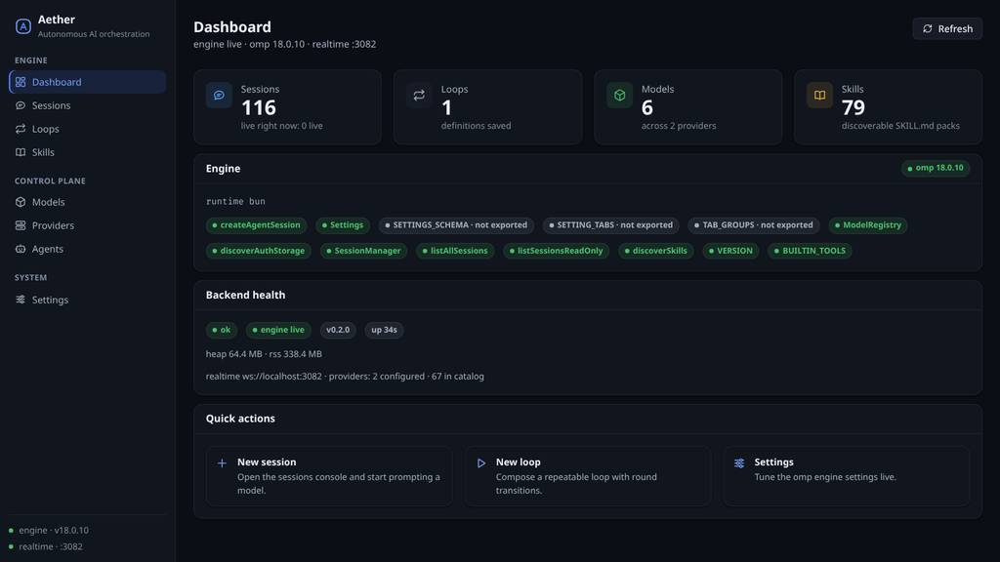
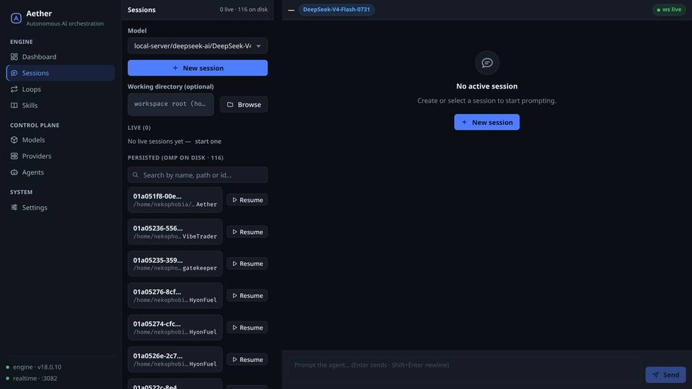
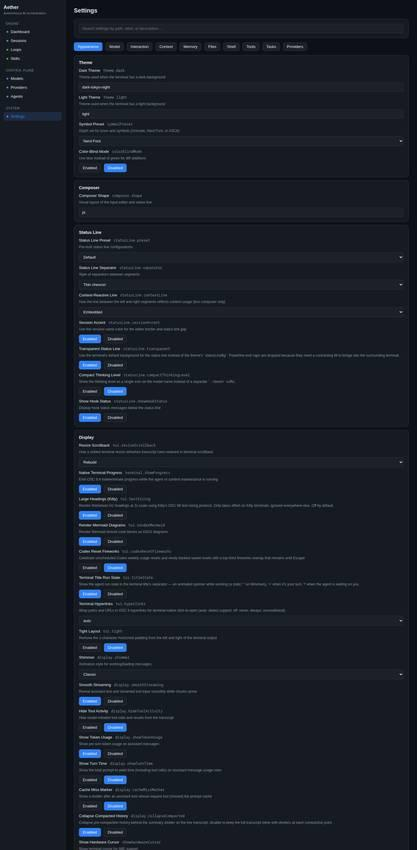

# Aether

Autonomous AI orchestration platform — a complete web GUI for the [Oh My Pi](https://github.com/can1357/oh-my-pi) coding agent (a fork of [Pi](https://github.com/badlogic/pi-mono), MIT).

One command, open a browser, drive the platform. No desktop app, no separate services: sessions, loops, skills, every AI provider, and all of omp's configuration behind a single web app and one HTTP/WebSocket API.

---

## Quick Start

### Docker (recommended)

```bash
docker compose up -d
# GUI + API  → http://localhost:3081
# realtime   → ws://localhost:3082
```

> Host ports are remapped to `3081`/`3082` because port `3001` on typical dev hosts is held by other local services (e.g. the Hermes MCP gateway), and both are published on `127.0.0.1` only — the API can drive an agent with real tools, so LAN exposure is an explicit opt-in (drop the prefix **and** set `AETHER_API_KEY` + `AETHER_CORS_ORIGINS`). The container listens on internal `3001`/`3002`, and mounts your host omp config (`~/.omp`) so the engine sees your models. By default the API is same-origin-only for browsers (no cross-site reads/writes from any page you happen to have open), and the realtime channel enforces the same origin rule on every upgrade. With `AETHER_API_KEY` set, the GUI authenticates too: paste the key once in **Settings → API key** (kept per browser tab) and realtime connects with short-lived single-use tickets.

### Local development

```bash
npm install
npm run build             # tsc -b --force
npm run build:frontend    # vite build
bun run packages/aether-backend/src/main.ts
# → http://localhost:3001  ·  ws://localhost:3002
```

Requires **Bun ≥ 1.3.14** at runtime (the agent engine only runs under Bun) and **Node 22+** for tooling/tests.

---

## What you get

| Capability              | What it does                                                                                                                                                                                                                                                |
| ----------------------- | ----------------------------------------------------------------------------------------------------------------------------------------------------------------------------------------------------------------------------------------------------------- |
| **Sessions**            | Full agent console. Pick any model in the catalog, prompt it, watch text/thinking/tool calls stream live over WebSocket, compact, and dispose. Sessions are **durable**: every journal is written into omp's real session store, and the persisted-session browser (every project, transcripts included) can resume any transcript — even one from before a restart — straight back into a live session. |
| **Loops**               | Indefinite, workflow-controlled runs: `[round N] → [transition] → [round N+1]`. Transitions — `none`, `compact`, `skill` (with per-round `{round}`-templated arguments), or an interactive `gate` where _you_ decide — plus `maxRounds`/`maxTimeMs`/manual stop. Loop definitions persist across restarts (atomically; a corrupt store is quarantined, never silently dropped). |
| **Skills**              | Every `SKILL.md` pack omp discovers — user, project, and managed-skills sources — browsable with full bodies on demand; wire any one in as a loop transition.                                                                                               |
| **Models**              | Live catalog from the omp registry (60+ providers + custom `models.yml`), used by every model picker.                                                                                                                                                       |
| **Providers**           | Searchable catalog of every provider omp knows with **real per-provider auth state** — provision, replace or revoke an API key from the row, verify reachability live, and register/delete custom providers (written to `models.yml`, 0600, with `.bak`).     |
| **Agents**              | omp's real agent definitions (bundled `task`/`scout`/`reviewer`/… + user/project agent markdown) with source, description, and inspectable bodies.                                                                                                          |
| **Settings**            | Schema-driven editor generated from omp's own `SETTINGS_SCHEMA` — every config knob across all 10 tabs, written back to your user config.                                                                                                                   |
| **Working directories** | Pick a real host directory per session or loop (browse the filesystem in the GUI) — so one session can edit repo A while another edits repo B at the same time. The agent's tools run in that directory.                                                    |
| **Web GUI**             | Dashboard, Sessions, Loops, Skills, Models, Providers, Agents, Settings — every API capability has a view.                                                                                                                                                  |

---

## Screenshots

| Dashboard                                                                                                                                                                             | Sessions                                                                                                                                                                |
| ------------------------------------------------------------------------------------------------------------------------------------------------------------------------------------- | ----------------------------------------------------------------------------------------------------------------------------------------------------------------------- |
|  |  |

| Settings (schema-driven editor)                                                                                                                    |
| -------------------------------------------------------------------------------------------------------------------------------------------------- |
|  |

---

## Documentation

| Doc                                      | What it covers                                                                                    |
| ---------------------------------------- | ------------------------------------------------------------------------------------------------- |
| [Architecture](docs/ARCHITECTURE.md)     | System topology, the three packages, why the runtime is Bun, backend internals, security, operations. |
| [API Reference](docs/API.md)             | Every REST endpoint + the realtime WebSocket protocol, with request/response shapes.              |
| [Development Guide](docs/DEVELOPMENT.md) | Setup, build/run/test, adding a model, Docker, and where the engine code lives.                   |
| [Changelog](docs/CHANGELOG.md)           | Release history.                                                                                  |

---

## Roadmap

- API-key/role provisioning UX for **Aether's own** API (roles are honored end-to-end;
  provider keys now live in the GUI since v0.3.8 — `AETHER_API_KEY` itself is still env-provisioned).
- Skill create/import flow writing `SKILL.md` into user/project skill dirs.

---

## License

MIT.
